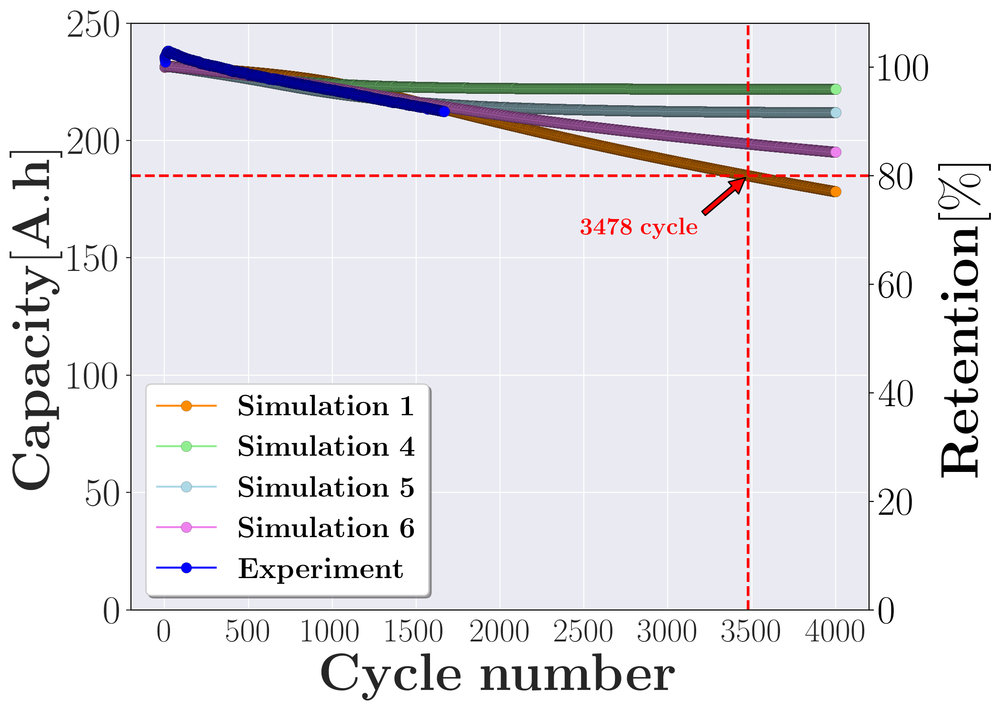
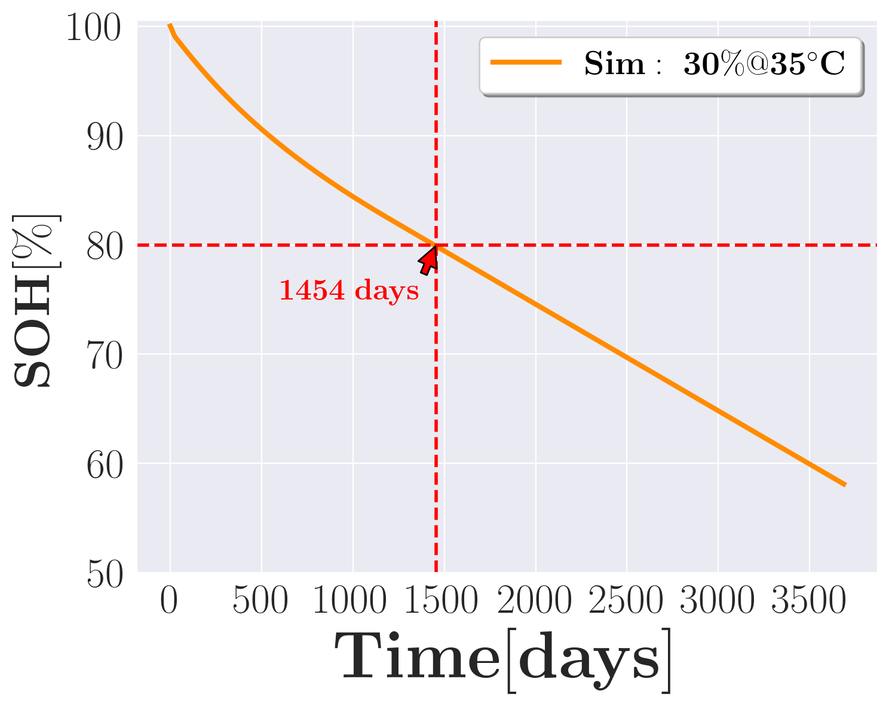

# Battery Modeling Tools

This repository provides command line utilities for parameter optimisation and
simulation of lithium-ion battery models using
[PyBaMM](https://github.com/pybamm-team/pybamm).
It contains several standalone scripts together with helper functions located
in `pybamm_parameter_optimization`.

The code relies on Python 3 and requires packages such as `pybamm`, `numpy`,
`pandas`, `matplotlib`, `seaborn`, `psutil` and `scipy`.

## Scripts

### `run_optimization.py`
Optimize selected model parameters so that simulated results match provided
experimental data.

```
python run_optimization.py \
  --DATA_PATH <csv> \
  --SAVE_DIR <output-directory> \
  --CPU_CORE_IDX <core> \
  --protocol_config <protocol.yaml> \
  --parameters_values <parameter-set> \
  --parameters_config <parameters.yaml> \
  --optim_config <optimization.yaml>
```

Arguments:
- `DATA_PATH` – CSV file containing experimental voltage and capacity data.
- `SAVE_DIR` – directory where results will be written.
- `CPU_CORE_IDX` – CPU index to bind the process to.
- `protocol_config` – YAML file describing the experiment protocol.
- `parameters_values` – name of the base PyBaMM parameter set.
- `parameters_config` – YAML file with initial parameter values.
- `optim_config` – YAML file describing optimisation settings.

### `run_DOE.py`
Run a design of experiments by varying parameters on a grid and comparing the
model voltage curve against experimental data.

```
python run_DOE.py \
  --DATA_PATH <csv> \
  --SAVE_DIR <output-directory> \
  --CPU_CORE_IDX <core> \
  --config <doe.yaml> \
  --parameters_config <parameters.yaml>
```

### `run_single_experiment.py`
Execute a single (or long) simulation cycle with the specified protocol and
parameter settings.  It can optionally include SEI parameters.

```
python run_single_experiment.py \
  --DATA_PATH <csv> \
  --SAVE_DIR <output-directory> \
  --CPU_CORE_IDX <core> \
  --protocol_config <protocol.yaml> \
  --parameters_values <parameter-set> \
  --parameters_config <parameters.yaml> \
  --sei_parameters_config <sei.yaml>
```

### `run_cycle_experiment.py`
Perform repeated cycling of the cell while optionally updating SEI related
parameters.

```
python run_cycle_experiment.py \
  --SAVE_DIR <output-directory> \
  --CPU_CORE_IDX <core> \
  --protocol_config <protocol.yaml> \
  --parameters_values <parameter-set> \
  --parameters_config <parameters.yaml> \
  --sei_parameters_config <sei.yaml>
```


#### - View results:
Read the data from your `SAVE_DIR`

```
from pybamm_parameter_optimization.utils import get_cycle_col, start_plot
import seaborn as sns

sim_df = pd.read_csv(f"{SAVE_DIR}/3900_4000_results.csv")
cycle_Q_sim = get_cycle_col(col="Discharge capacity [A.h]", cycle_df=sim_df, step_idx=4)

fig, ax = start_plot(dpi=200, figsize=(10, 8), style="darkgrid")
sns.lineplot(x=cycle_Q_sim.index, y=cycle_Q_sim, marker="o",
            label=rf"$\bf\\Simulation\ 1$", 
            color="darkorange", markersize=8, markeredgecolor='black', markeredgewidth=0.1)

```




### `run_calendar_experiment.py`
Simulate calendar ageing including optional preprocessing steps.

```
python run_calendar_experiment.py \
  --SAVE_DIR <output-directory> \
  --CPU_CORE_IDX <core> \
  --protocol_config <protocol.yaml> \
  --parameters_values <parameter-set> \
  --parameters_config <parameters.yaml> \
  --sei_parameters_config <sei.yaml>
```


#### - View results:
Read the data from your `SAVE_DIR`

```
from pybamm_parameter_optimization.utils import get_cycle_col, start_plot
import seaborn as sns

sim_df = pd.read_csv(f"{SAVE_DIR}/results.csv")
calendar_sim = return_calendar_df(sim_df, charge_cycles=list(np.arange(3, 843, 7)))

fig, ax = start_plot(dpi=200, figsize=(8, 6), style="darkgrid")
sns.lineplot(data=calendar_sim,
             x=xcol, y=ycol, 
             label=rf"$\bf\\Sim:\ 30\%@35^{{\circ}} C$", 
            color="darkorange", linewidth=3)

```




### `run.sh`
A convenience shell script which runs the above commands with example paths.
Modify it to match your environment before use.

## Configuration Files
YAML files in the `config/` directory provide example parameter settings and
optimisation options.  All scripts expect experiment data in CSV format with at
least `Voltage [V]` and `Discharge capacity [A.h]` columns.

## Library
The package `pybamm_parameter_optimization` implements helper utilities and the
`ParameterOptimized` class used for optimisation routines.